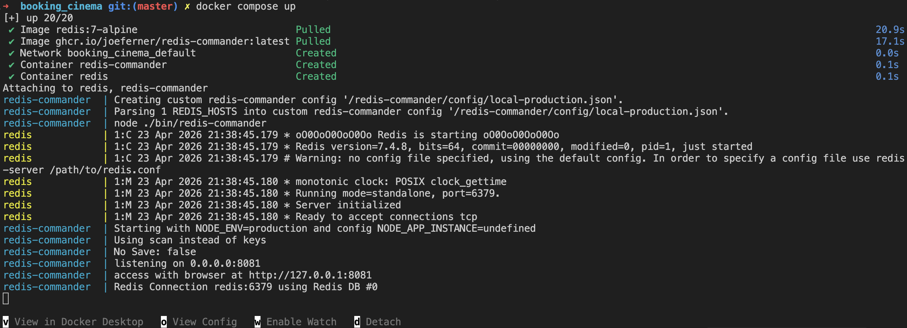
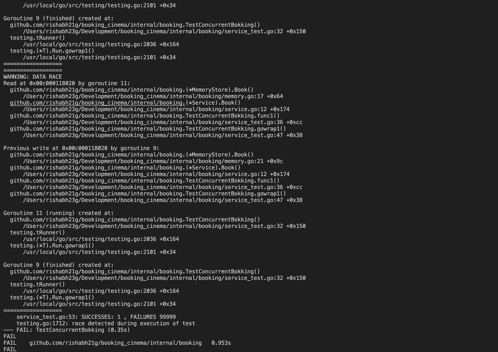
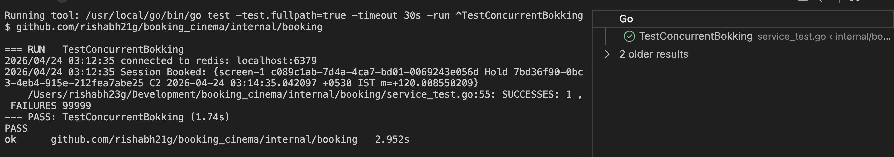
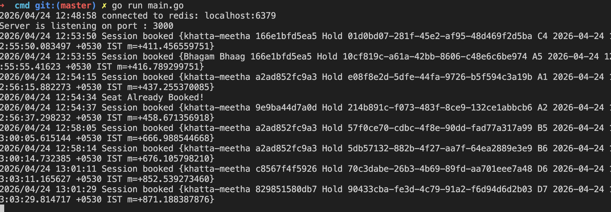
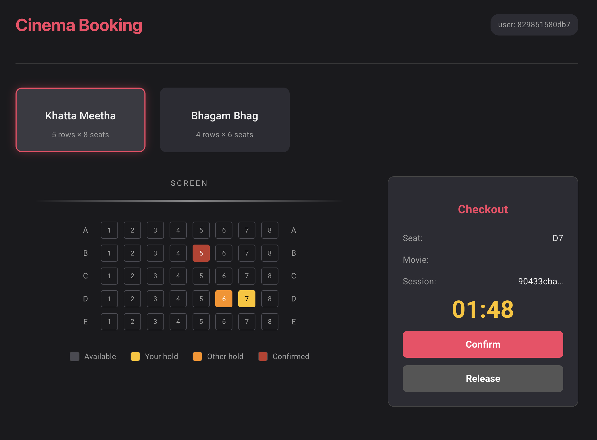
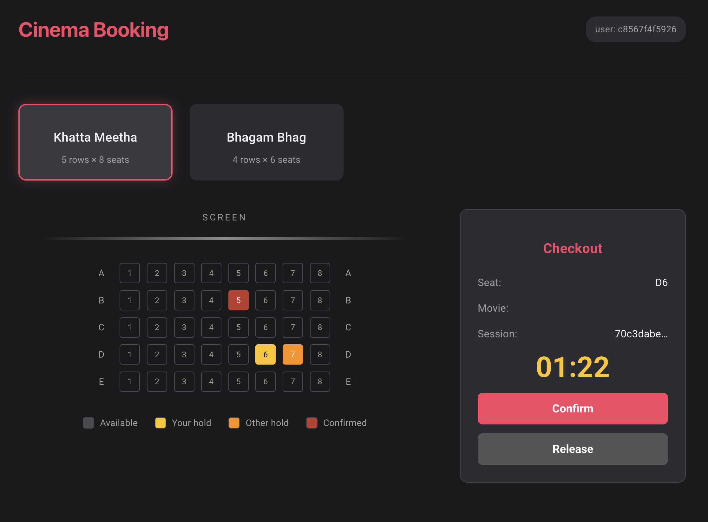

# 🎬 Cinema Booking

A full-stack seat booking system built to demonstrate **concurrency safety** — what happens when 100 users click the same seat at the same time?

**Stack:** Go · Redis · React (Vite)

---

## Overview

| Layer | Tech | Purpose |
|-------|------|---------|
| Backend | Go + `net/http` | REST API with layered architecture |
| State | Redis (Docker) | Atomic seat holds with TTL |
| Frontend | React + Vite | Live seat grid with polling |

---

## What You'll Learn

### Go Backend
- REST endpoints with `net/http` and `http.ServeMux`
- Layered architecture: **handler → service → store**
- **Atomic Redis writes** (NX mode) to prevent double-booking
- Hold / confirm / release flows with TTL expiry
- Concurrency testing with `go test -race`

### React Frontend
- Data fetching and timers with `useState`, `useEffect`, `useCallback`
- Componentized UI — movie list, seat grid, checkout panel, countdown timer
- Polling strategy to keep the seat grid in sync with the backend
- Vite dev proxy to avoid CORS and "HTML instead of JSON" gotchas

---

## Architecture

```
HTTP Request
    │
    ▼
┌─────────────┐     ┌───────────────┐     ┌─────────────────┐
│   Handler   │────▶│    Service    │────▶│   Redis Store   │
│  (HTTP I/O) │     │ (thin bridge) │     │ (atomic writes) │
└─────────────┘     └───────────────┘     └─────────────────┘
```

| File | Role |
|------|------|
| `cmd/main.go` | Server entry point — wires routes and dependencies |
| `internal/booking/handler.go` | HTTP handlers — parse input, call service, write JSON |
| `internal/booking/service.go` | Service layer — thin bridge to the store |
| `internal/booking/redis_store.go` | Redis store — atomic holds, confirm, release |
| `utils/utils.go` | Shared JSON helpers |
| `internal/adapter/redis/redis.go` | Redis client adapter |
| `cinema_booking/src/App.tsx` | Frontend orchestrator — API calls and polling |
| `cinema_booking/src/components/` | UI components |
| `cinema_booking/src/types/types.ts` | TypeScript types for API payloads |

---

## Project Structure

```
.
├── cmd/
│   └── main.go
├── internal/
│   ├── adapter/
│   │   └── redis/redis.go
│   └── booking/
│       ├── domain.go            # Booking struct + BookingStore interface
│       ├── handler.go
│       ├── service.go
│       ├── redis_store.go       # ← primary store (production-ready)
│       ├── memory.go            # legacy: non-thread-safe in-memory store
│       ├── concurrent_store.go  # legacy: mutex-based store
│       └── service_test.go      # concurrency test
├── cinema_booking/
│   ├── src/
│   │   ├── App.tsx
│   │   ├── App.css
│   │   ├── components/
│   │   └── types/types.ts
│   ├── vite.config.ts           # dev proxy → backend
│   └── package.json
├── images/
├── docker-compose.yml           # Redis + redis-commander
└── go.mod
```

---

## API Reference

### Movies

```
GET /movies
```
Returns the hardcoded list of movies.

```
GET /movies/{movieID}/seats
```
Returns current seat statuses for a movie.

### Booking Lifecycle

```
POST /movies/{movieID}/seats/{seatID}/hold
Body: { "user_id": "..." }
```
Atomically holds a seat for the TTL duration. Returns a session ID.

```
PUT /sessions/{sessionID}/confirm
Body: { "user_id": "..." }
```
Makes a held seat permanent (removes TTL, marks as confirmed).

```
DELETE /sessions/{sessionID}
Body: { "user_id": "..." }
```
Releases a hold (deletes the seat key and session mapping).

---

## Booking Flow

```
1. GET /movies
         │
         ▼
2. GET /movies/{id}/seats        ← polled every 2 seconds
         │
         ▼
3. POST .../hold                 ← atomic Redis NX write
   ┌─────────────────────────────────────────────┐
   │  100 users click the same seat              │
   │  → exactly 1 succeeds                       │
   │  → 99 get "Seat Already Booked!"            │
   └─────────────────────────────────────────────┘
         │
         ▼
4. PUT  .../confirm              ← persist (remove TTL)
   — or —
   DELETE .../sessions/{id}      ← release (delete keys)
```

---

## Redis Key Design

| Key | Value | TTL |
|-----|-------|-----|
| `seat:{movieID}:{seatID}` | JSON booking payload | 2 min (hold) / none (confirmed) |
| `session:{sessionID}` | Associated seat key | Same as hold TTL |

The atomic `SET ... NX` on the seat key is what makes concurrency safe — only one write wins.

---

## Screenshots

### Redis running via Docker


### Concurrency test output



### Backend logs


### Frontend UI



---

## Getting Started

**Prerequisites:** Go, Node.js + npm, Docker

```bash
# 1. Start Redis (+ Redis Commander at http://localhost:8081)
docker compose up -d

# 2. Start the backend  →  http://localhost:3000
go run cmd/main.go

# 3. Start the frontend  →  http://localhost:5173
cd cinema_booking && npm install && npm run dev
```

---

## Concurrency Test

```bash
go test -race ./internal/booking/...
```

Spawns 100,000 goroutines all trying to hold the same seat simultaneously.

**Expected result:** `successes = 1`, `failures = 99,999`

---

## Known Quirks (Good Learning Opportunities)

These aren't bugs that block the app — they're intentional teaching moments worth reading carefully:

**JSON key mismatch** — The hold response returns `movieID` from the handler, but the frontend types expect `movie_id`. If the Checkout panel shows an empty movie field, align the JSON keys on both sides.

**Legacy stores** — `memory.go` and `concurrent_store.go` exist as historical examples. The current `BookingStore` interface uses session-style returns `(Booking, error)`, so these would need updates before they could plug back into the service layer.

**Trailing space in session key** — The session key helper in `redis_store.go` includes a trailing space in the key format. It works correctly as long as the same helper is called on both read and write, but it's an unusual pattern and a good "spot the quirk" exercise.

---

## License

MIT